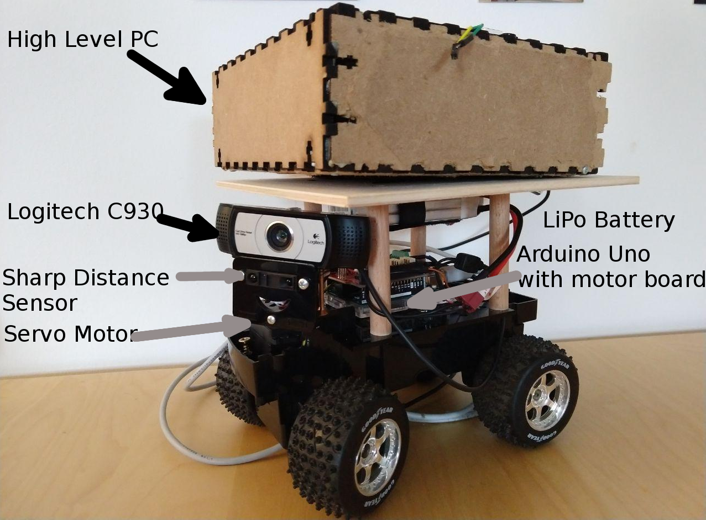
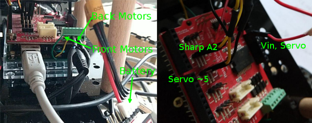
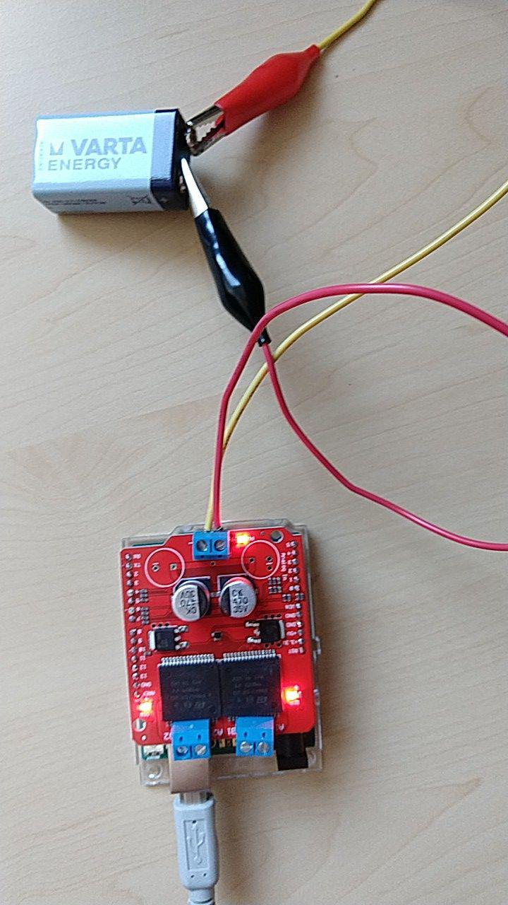

# alfons_robot_bringup

## Overview

This is a [ROS] package developed for alfons which is a mobile robot that is carlike. This means it is controlled via ackermann steering. This package includes the main launch file to start the alfons robot. The source code of this project has to be flashed onto the arduino uno using the Arduino IDE.

This package has been tested under ROS Kinetic and Ubuntu 16.04. This is research code, expect that it changes often and any fitness for a particular purpose is disclaimed.

**Author: Markus Lamprecht<br />
Maintainer: Markus Lamprecht, 2f4yor@gmail.com<br />**



## Installation

### Dependencies

This software is built on the Robotic Operating System ([ROS]), which needs to be [installed](http://wiki.ros.org) first. Additionally, this package depends on following software:

- arduino IDE necessary to flash program to the arduino UNO
- create the symlink SharpIR in /home/arduino/arduino-1.8.5/libraries to /libs/SharpIR of this package
- [alfons_msgs] messages for the project
- [simple_kf]
- [aruco_detector_osv]
- [rviz_pics]
- [tf_mapping] 

### Building

In order to install this package, clone the latest version from this repository into your catkin workspace and compile the package using [catkin_tools](https://catkin-tools.readthedocs.io/en/latest/)

    cd catkin_workspace/src
    git clone git@github.com:CesMak/alfons_robot_bringup.git
    cd ..
    catkin init
    catkin build


## Basic Usage

- Connect sensor's to the board as follows (Description also available at the begin of /src/robot_control/robot_control.ino)


- Connect aruduino uno USB with PC
- Start arduino IDE with the code of this project **/src/robot_control/robot_control.ino**
- Flash code to arduino uno
- Connect camera with PC
- Start the main launch file
- (optional: turn on battery to get more power than by USB Power in)

## Main Launch file

``` 
    roslaunch alfons_robot_bringup start_robot.launch
``` 

## License BSD
If you want to use this package please contact: [me](https://simact.de/about_me).


## TODO's 

- How to measure battery voltage and use the battery power as well. Currently this is shortcuting and destroing the arduino uno
- Currently the motor board gets really hot during operation (battery has too much input voltage?, or program too computationally intensive)
- Part of the hardware (arduino board, arduino motor shield, servo, sharp distance sensor) is contained [here](https://github.com/watterott/StarterKit-Robotics)
- Docu of the motor shiled [here](https://store.arduino.cc/arduino-motor-shield-rev3)
- **Use 9V power source of remote control car!**


## Hardware Specs

## Log

* First a motor shield rev. 1.0 was used but this heated up very quickly and was therefore not used. 
* Secondly a [monster moto shield (sparkfun)](https://www.ebay.de/itm/30A-VNH2SP30-Dual-Stepper-Motor-Driver-Monster-Moto-Shield-Module-Motortreiber-/122543212784) see question on [arduion-de-forum](https://forum.arduino.cc/index.php?topic=605814.0)
* Code to test is taken from [1](https://www.14core.com/wiring-the-vnh2sp30-30a-monster-moto-with-mcu/) and [2](https://www.instructables.com/id/Monster-Motor-Shield-VNH2SP30/)
* 

[ROS]: http://www.ros.org
[rviz]: http://wiki.ros.org/rviz
[grid_map_msg/GridMap]: https://github.com/anybotics/grid_map/blob/master/grid_map_msg/msg/GridMap.msg
[sensor_msgs/PointCloud2]: http://docs.ros.org/api/sensor_msgs/html/msg/PointCloud2.html
[geometry_msgs/PoseWithCovarianceStamped]: http://docs.ros.org/api/geometry_msgs/html/msg/PoseWithCovarianceStamped.html
[tf/tfMessage]: http://docs.ros.org/kinetic/api/tf/html/msg/tfMessage.html
[std_srvs/Empty]: http://docs.ros.org/api/std_srvs/html/srv/Empty.html
[grid_map_msg/GetGridMap]: https://github.com/anybotics/grid_map/blob/master/grid_map_msg/srv/GetGridMap.srv
[grid_map_msgs/ProcessFile]: https://github.com/ANYbotics/grid_map/blob/master/grid_map_msgs/srv/ProcessFile.srv